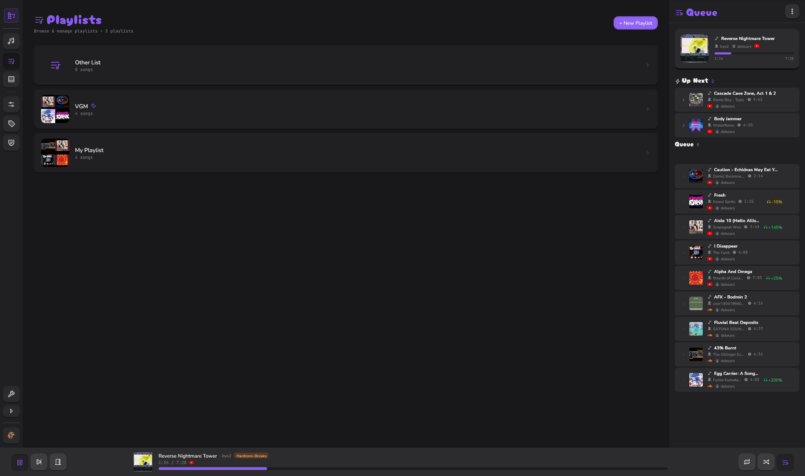
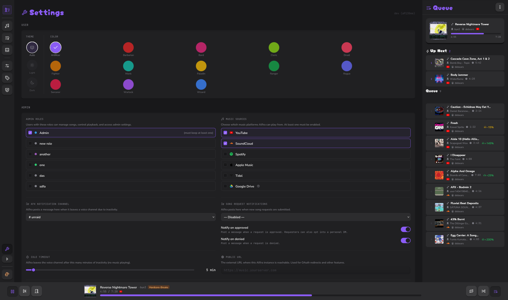
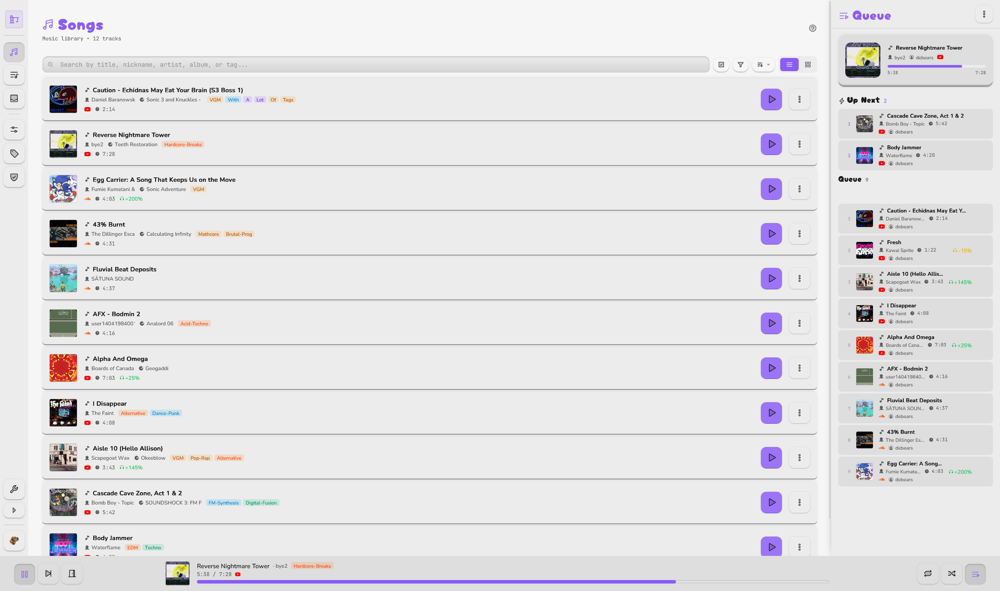
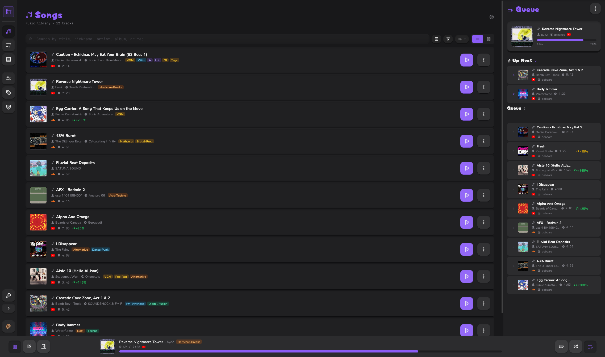
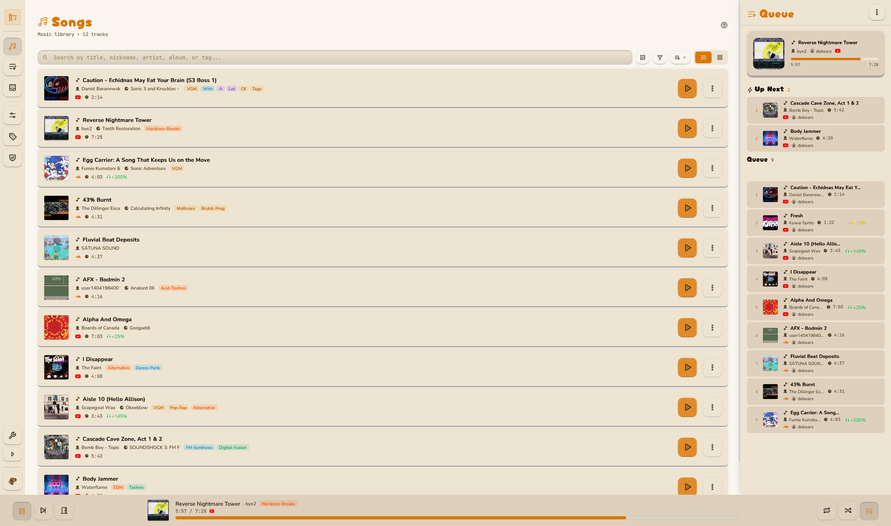
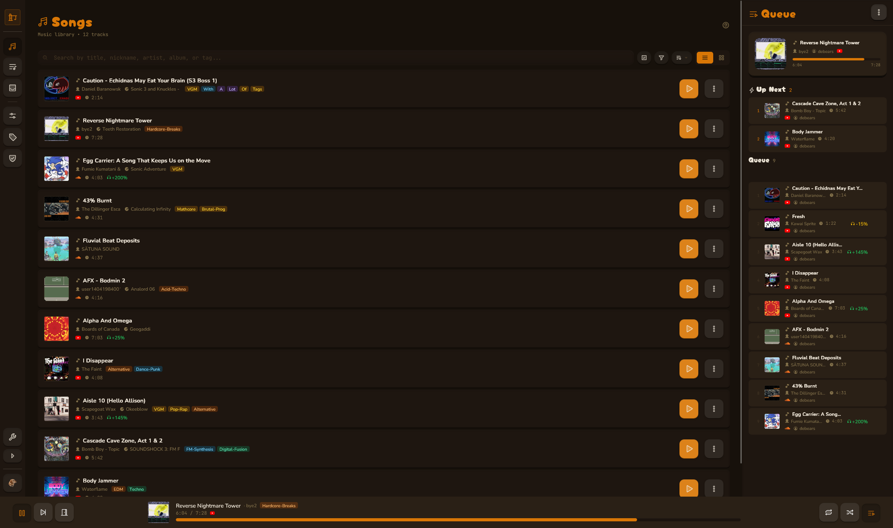
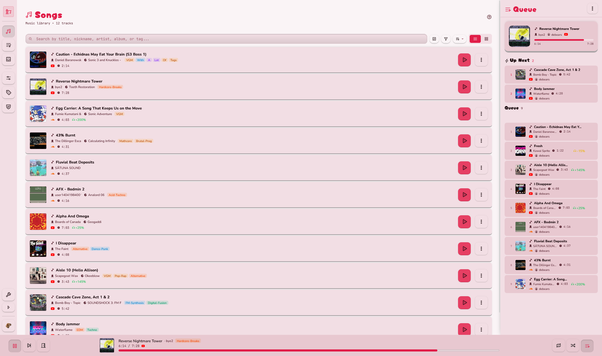
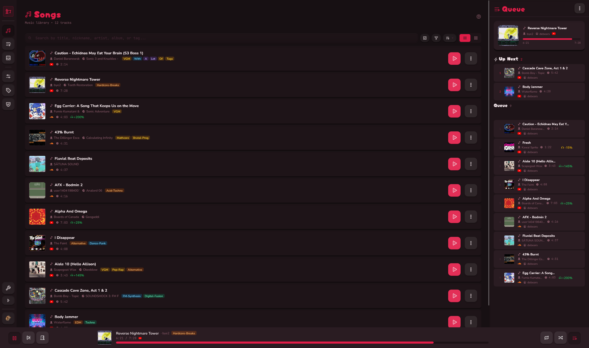

<h1 align="center">Alfira</h1>

<p align="center">
  
</p>

<p align="center">
  <strong>A self-hosted Discord music bot with a web UI for library management and playback control.</strong>
</p>

<p align="center">
  <a href="https://github.com/ebears/alfira"></a>
  <a href="https://github.com/ebears/alfira/actions/workflows/docker-build.yml"></a>
</p>

<p align="center">
  <a href="https://www.docker.com/"></a>
  <a href="https://bun.com/"></a>
  <a href="https://react.dev/"></a>
  <a href="https://tailwindcss.com/"></a>
  <a href="https://www.sqlite.org/"></a>
  <a href="https://github.com/drizzle-team/drizzle-orm"></a>
  <a href="https://github.com/tiramisulabs/seyfert"></a>
  <a href="https://github.com/PerformanC/NodeLink"></a>
</p>

## Screenshots

<p align="center">
  
</p>

<details>
<summary>More screenshots</summary>

<table align="center">
  <tr>
    <td></td>
    <td></td>
  </tr>
  <tr>
    <td></td>
    <td></td>
  </tr>
</table>

<br>

<p align="center"><strong>Theme examples</strong></p>

<table align="center">
  <tr>
    <td></td>
    <td></td>
    <td></td>
  </tr>
  <tr>
    <td></td>
    <td></td>
    <td></td>
  </tr>
</table>

</details>

## Features

- **Import songs** — Paste a YouTube link to save it to your library.
- **Playback** — Play, pause, seek, skip, loop, and shuffle. Optional server-wide equalizer and compressor.
- **Metadata editing** — Customize title, artist, album, cover art, tags, and per-song volume.
- **Playlists** — Create and manage private or public playlists from your library.
- **Search & filter** — Find songs by title, artist, album, or tags.

## Quick Start

Alfira only needs Docker.

```bash
# 1. Grab the compose file and env
curl -o docker-compose.yml https://raw.githubusercontent.com/ebears/alfira/main/docker-compose.prod.yml && curl -o .env https://raw.githubusercontent.com/ebears/alfira/main/.env.example

# 2. Edit .env with your preferred editor (vi / nano / vim / emacs / micro / code / zed)
vi .env

# 3. Start the stack — web UI at http://localhost:8180
docker compose up -d
```

See the **[Installation Guide](docs/installation.md)** for full details.

## Documentation

| Document | Description |
|----------|-------------|
| **[Installation Guide](docs/installation.md)** | Setup, environment variables, Docker commands |
| **[Philosophy](docs/philosophy.md)** | Design principles guiding the project |
| **[Tech Stack](docs/tech-stack.md)** | Technology stack and project structure |
| **[Biome Setup](docs/biome-setup.md)** | Editor setup for Biome linting and formatting |
| **[Troubleshooting](docs/troubleshooting.md)** | Common issues and solutions |

## License

This project is licensed under the MIT License — see the [LICENSE](LICENSE) file for details.
