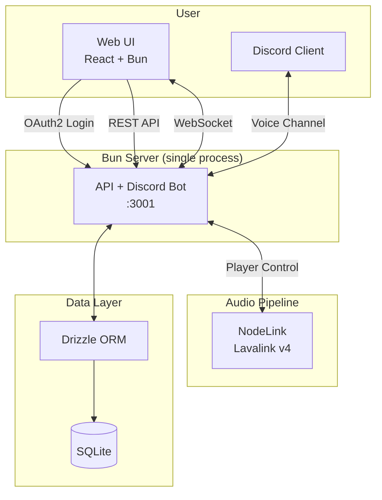

# Tech Stack

## Overview

| Component    | Technology                                             |
| ------------ | ------------------------------------------------------ |
| **Runtime**  | Bun                                                    |
| **Language** | TypeScript                                             |
| **Discord**  | Custom gateway (WebSocket) + REST                      |
| **Audio**    | NodeLink (Lavalink v4) — direct WebSocket + REST       |
| **API**      | Elysia + WebSocket                                     |
| **Database** | SQLite + Drizzle ORM                                   |
| **Frontend** | React 19 + Tailwind CSS 4 + motion (framer-motion v12) |
| **Logging**  | Custom (shared/logger)                                 |

## Architecture



## Project Structure

The project is a Bun workspaces monorepo:

```
packages/
├── server    # Bun API + Discord bot (GuildPlayer, NodeLink audio, custom Discord gateway)
│             # Also contains shared types, utilities, DB schema, and logger
└── web       # React 19 + Tailwind CSS 4 web UI
```

Shared code lives in `packages/server/src/shared/` and is imported by the web
package via the `@alfira/server/shared` export.

## Development Scripts

Top-level scripts:

| Script              | Description                                                              |
| ------------------- | ------------------------------------------------------------------------ |
| `bun dev`           | Lint + format check + tests → build web → start server with `--watch`    |
| `bun dev:docker`    | Full Docker integration test (lint + tests → build → docker compose up)  |
| `bun run web:build` | Build the web UI                                                         |
| `bun run check`     | Lint (type-aware) + format check + tests — the universal pre-commit gate |
| `bun run typecheck` | Lint with type-aware checking only                                       |
| `bun run lint:fix`  | Lint with auto-fix                                                       |
| `bun run format`    | Format with auto-fix                                                     |
| `bun test`          | Run all tests                                                            |

Additional QA tools:

| Tool     | Command                 | Purpose                                   |
| -------- | ----------------------- | ----------------------------------------- |
| knip     | `bunx knip`             | Find unused files, dependencies, exports  |
| lefthook | `bunx lefthook install` | Run lint + format check + tests on commit |

## Shared Package Exports

`@alfira/server/shared` provides types and utilities consumed by the web package:

### Types

| Type             | Description                                                                              |
| ---------------- | ---------------------------------------------------------------------------------------- |
| `Song`           | Database song model (id, title, sourceUrl, sourceId, duration, thumbnailUrl, etc.)       |
| `QueuedSong`     | Song with `requestedBy` display name (runtime queue property)                            |
| `LoopMode`       | `'off'` \| `'song'` \| `'queue'`                                                         |
| `QueueState`     | Full player state snapshot for real-time broadcasts                                      |
| `Playlist`       | Database playlist model with inline songs array, optional song count, and cover art grid |
| `PlaylistDetail` | Playlist with fully populated songs array (song guaranteed present)                      |
| `User`           | Authenticated Discord user (discordId, username, avatar, isAdmin)                        |

### Utilities

| Function                    | Description                             |
| --------------------------- | --------------------------------------- |
| `formatDuration(seconds)`   | Formats seconds as `mm:ss` or `h:mm:ss` |
| `fisherYatesShuffle(array)` | In-place Fisher-Yates shuffle           |

## CI Workflows

Four GitHub Actions workflows run on the repository:

| Workflow             | Trigger                                               | Purpose                                                                              |
| -------------------- | ----------------------------------------------------- | ------------------------------------------------------------------------------------ |
| **ci.yml**           | All PRs, pushes to `main` and `dev`                   | `bun run check` (lint + format check + tests) + build all packages + Trivy vuln scan |
| **codeql.yml**       | All PRs, pushes to `main` and `dev`, weekly schedule  | CodeQL security analysis                                                             |
| **docker-build.yml** | All PRs, pushes to `main` and `dev` (ignores `docs/`) | Build Docker images; publish to GHCR on `main`                                       |
| **release.yml**      | Pushes of `v*` tags                                   | Build multi-arch Docker image, push to GHCR, draft GitHub release                    |
